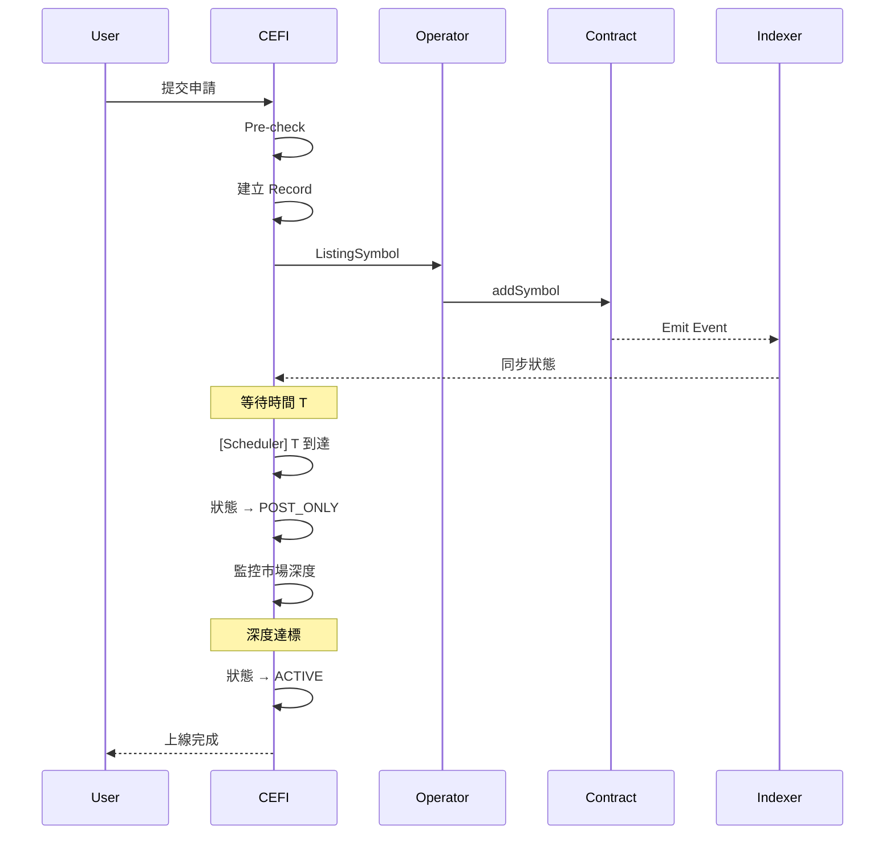

# 產品需求文件（PRD）— 無許可上架

## Reference
1. BRD
2. Figma
3. [Perps Listing Parameters Rules](./Orderly_Perps_Listing_Parameters_Rules.md)

---

# 1. 背景與問題

目前 Orderly Network 的 Symbol 上線流程依賴人工審核與特定的 MM 支持，這帶來了以下問題：
1. 上幣效率低：人工流程導致上線速度慢，無法滿足市場快速變化的需求
2. 營運成本高：每上一個新 Symbol 都需要大量的人力投入進行審核與配置
3. 風險共擔問題：所有 Symbol 共用同一個保險基金 (Insurance Fund)，新幣種的高波動性可能威脅到平台的整體安全

因此，建立「無許可上幣 (Permissionless Listing)」機制勢在必行。此機制將允許符合資格的 Broker（項目方）無許可完成上幣，而平台則透過標準化的規則與自動化檢查來確保安全性與一致性。

---

# 2. 目標

## 2.1 產品目標
1. 無許可上幣：賦能符合資格的 Broker 自行完成 Symbol 的參數配置與上架
2. 自動化風控：建立自動化檢查機制（價格、流動性、保證金），取代人工審核
3. 項目方層級風險隔離：確保單一項目方的Listing穿倉損失由該項目方獨立的 Insurance Fund 承擔，不影響平台的 IF 與其他項目方的IF
4. 維持上架標準：確保即使是無許可上架的 Symbol，仍具備完整的風控要素（價格來源、保險、清算、流動性）

## 2.2 業務目標
1. 生態擴展：大幅提升可交易 Symbol 的數量與上架速度，促進交易量增長
2. 責任轉移：
   - 項目方需自行擔任做市商 (MM) 並提供該 Symbol 的獨立風險基金 (IF)
   - 平台回歸技術提供者角色，專注於撮合與清算服務
3. 收益共享：提供 30%-50% 的交易手續費分潤作為激勵，吸引優質項目方參與

---

# 3. 限制與邊界

| # | 限制項目 | 說明 |
|---|----------|------|
| 1 | 資格限制 | 僅對滿足 Staking 要求的 Diamond Tier Broker 開放(交易達成的不行) |
| 2 | 帳號要求 | Broker 必須配置完整的帳號體系（IF、Fee、Liquidation、MM Account）才能進行上架 |
| 3 | 風控一致性 | 除上架流程外，交易層面的風控規則（如保證金計算、清算邏輯）與現有系統保持一致 |
| 4 | 一次性流程 | 本期僅支援「首次上架」，不支援無許可重新上架 (Re-listing)；若需重新上架需透過人工流程處理 |
| 5 | 參數變更 | 上架後的部分參數修改暫不開放項目方自行修改，需由 Orderly Admin 協助|
| 6 | 資金隔離 | 項目方 IF 與平台主 IF 完全隔離，項目方 Symbol 的虧損責任僅限於其提供的 IF 餘額 |
| 7 | 唯一性 | 每個 Symbol 全平台唯一。當有人正在建立某 Symbol 的上架申請（NEW 階段）時，其他人無法針對該 Symbol 建立新的申請，直到原申請失效或完成。 |
| 8 | 黑名單 | 平台維護禁止上架的 Symbol 黑名單，項目方無法上架黑名單內的 Symbol |
| 9 | 保證金模式 | 這些Symbol預設僅支援 Isolated Margin (逐倉)，開啟 Cross Margin (全倉) 需通過額外申請 |

---

# 4. 無許可上架生命週期總覽

| 階段 | 狀態 | 開發範圍 |
|------|------|----------|
| 上架前 | - | 帳號體系（IF、Fee、Liquidation、MM）、資格驗證 |
| 上架中 | Pending → Post-only | 參數自動化、規則引擎、風控檢查、上架流程 |
| 上架後 | Active | 監控系統、警告機制、事件處理 |
| 暫停/限制 | Reduce-only | 風控觸發後的限制交易狀態、等待項目方補充資金或修復問題 |
| 下架 | Delisted | 下架平倉流程（比照現在的下架流程） |

### 上架中狀態轉換

```
Pending ──────────────► Post-only ──────────────► Active
        項目方設定時間              市場深度達標後
        或立即啟動                  自動解除限制
```

| 子狀態 | 說明 | 轉換條件 |
|--------|------|----------|
| Pending | 風控通過，等待啟動 | 項目方設定啟動時間或立即進入 Post-only |
| Post-only | 僅 MM 可掛單，監控市場深度 | 達到一定市場深度後自動進入 Active |

---

# 5. 上架前（Pre-listing）

## 5.1 帳號體系

項目方需建立以下子帳號以支援無許可上架。所有帳號由項目方自行管理與承擔風險。

### 帳號架構圖

```
┌─────────────────────────────────────────────────────────────────┐
│                      Broker Admin Account                       │
│                     (Diamond Tier Required)                     │
└───────────────────────────────┬─────────────────────────────────┘
                                │
        ┌───────────────────────┼───────────────────────┐
        ▼                       ▼                       ▼
  ┌───────────┐           ┌───────────┐           ┌───────────┐
  │    IF     │           │    Fee    │           │    Liq    │
  │  Account  │           │  Account  │           │  Account  │
  │   (1個)   │           │   (1個)   │           │   (1個)   │
  └─────┬─────┘           └─────┬─────┘           └─────┬─────┘
        │                       │                       │
        └───────────────────────┼───────────────────────┘
                                │
                         所有 Symbol 共用
                                │
┌───────────────────────────────┼───────────────────────────────┐
│                               ▼                               │
│   ┌─────────────────────────────────────────────────────┐    │
│   │              MM Account Pool                         │    │
│   │           （上限由 Orderly 配置）                     │    │
│   │  ┌────────┐ ┌────────┐ ┌────────┐ ┌────────┐       │    │
│   │  │MM Acc#1│ │MM Acc#2│ │MM Acc#3│ │MM Acc#4│  ...  │    │
│   │  └───┬────┘ └───┬────┘ └───┬────┘ └───┬────┘       │    │
│   └──────┼──────────┼──────────┼──────────┼────────────┘    │
│          │          │          │          │                  │
│          ▼          ▼          ▼          ▼                  │
│   ┌─────────────────────┐  ┌─────────────────────┐          │
│   │      AAA-PERP       │  │      BBB-PERP       │          │
│   │  (MM #1, #2 綁定)    │  │  (MM #3, #4 綁定)   │          │
│   └─────────────────────┘  └─────────────────────┘          │
│                                                               │
│                    多個 MM 可服務同一 Symbol                   │
└───────────────────────────────────────────────────────────────┘
```

### 帳號類型說明

| 帳號類型 | 數量 | Symbol 關係 | 交易限制 | 資金規則 |
|----------|------|-------------|----------|----------|
| IF Account | 1 個 | 全部共用 | 僅 RO 單 | 僅 USDC；轉出需 >= 150% min_balance，需監控餘額 |
| Fee Account | 1 個 | 全部共用 | 禁止交易 | 無限制 |
| Liquidation Account | 1 個 | 全部共用 | 僅 RO 單 | 轉出需 >= 150% min_balance，需監控餘額 |
| MM Account | 多個 | 多:1（多個 MM 可服務同一 Symbol） | 僅綁定的 Symbol | 數量上限由 Orderly 配置 |

---

## 5.2 帳號建立流程

### IF / Fee / Liquidation Account

三者建立流程相同，但流程上分開配置：

| 步驟 | 操作 |
|------|------|
| 1 | 進入「帳號管理」頁面 |
| 2 | 點擊對應的 Account |
| 3 | 輸入子帳戶ID（須為 Admin Account 的子帳戶） |
| 4 | 系統確認並綁定 |

### MM Account

MM Account 需先建立，上架 Symbol 時再選擇綁定。

| 步驟 | 操作 | 驗證 |
|------|------|------|
| 1 | 進入「帳號管理」頁面 | - |
| 2 | 點擊「新增 MM Account」 | 檢查是否已達上限 |
| 3 | 輸入帳號名稱 | <= 50 字元 |
| 4 | 配置手續費 | - |
| 5 | 系統確認建立 | - |

> 建立後的 MM Account 可在上架 Symbol 時選擇綁定，一個 Symbol 可綁定多個 MM Account。

---

# 6. 申請上架（Listing）

## 6.1 上架流程

```
填寫資料 ──────► Pre-check ──────► 預覽參數 ──────► 設定上架時間 (T)
   ▲               │                                  │
   │               ▼                                  ▼
   └─────────── 失敗/修改                       驗證時間 T
                                                      │
          ┌───────────────────────────────────────────┘
          ▼
    T >= Now + 1hr (整點) ?
    │              │
    │ No           │ Yes
    │ (退回重選)    │
    │              ▼
    └─────► 確認提交 ──► [CEFI] 發送 addSymbol 至合約
                   │
                   ▼
          [ Pending ] 狀態 ◄──────────────┐
          (等待時間 T 到達)                │
               │                          │
               ├─── 項目方修改設定 ─────────┘
               │    (重置上架時間)
               │    (T-30min 內禁止修改)
               │
               ▼ 時間 T 到達

          [ Post-only ] 狀態
          (僅 MM 可掛單)
               │
               ▼ 市場深度達標 (Ask/Bid < 2% range & > $10k depth)
               │
          [ Active ] 狀態
          (全面開放交易)
```
**上架時間規則：**
- T 必須 >= 當前時間 + 1 小時
- T 必須為整點時間（例：現在 14:35，最早可選 16:00）
- 不支援立即上架，時間不符合規則會拒絕

---

### 6.1.1 系統流程

```
User          CEFI              Operator           Contract          Indexer
  │            │                   │                  │                 │
  ├─ 提交申請 ─►│                   │                  │                 │
  │            ├─ Pre-check        │                  │                 │
  │            ├─ 建立 Record      │                  │                 │
  │            ├─ ListingSymbol ──►├─ addSymbol ─────►│                 │
  │            │                   │                  ├─ Emit Event ───►│
  │            │◄─────────────────────────────────────────── 同步狀態 ──┤
  │            │                   │                  │                 │
  │            │  ══ 等待時間 T ═══    │                 │
  │            │                   │                  │                 │
  │            ├─ [Scheduler] T 到達                  │                 │
  │            ├─ 狀態 → POST_ONLY │                  │                 │
  │            ├─ 監控市場深度     │                  │                 │
  │            │                   │                  │                 │
  │            │ ═══ 深度達標 ══     │                 │
  │            │                   │                  │                 │
  │            ├─ 狀態 → ACTIVE    │                  │                 │
  │            │                   │                  │                 │
  ◄── 上線完成 ┤                   │                  │                 │
```




| 階段 | 觸發條件 | 執行者 | 動作 |
|------|---------|--------|------|
| 提交 | 用戶確認 | CEFI | Pre-check → 建立 Pending Record |
| 上傳 | Pre-check 通過 | Operator | 上傳 symbol, symbolHash, symbolContractID |
| 同步 | Contract Event | Indexer | 同步狀態至 CEFI |
| 等待 | - | CEFI | 等待時間 T 到達 |
| Post-only | 時間 T 到達 | CEFI | 開放 MM 掛單，監控深度 |
| Active | 深度達標 | CEFI | 開放所有用戶交易 |

---
  
### 6.1.2 狀態轉換總表

| 當前狀態 | 觸發條件 | 目標狀態 | 執行者 |
|---------|---------|---------|--------|
| NEW | Pre-check 通過 + 合約寫入成功 | PENDING | System |
| PENDING | 時間 T 到達 | POST_ONLY | Scheduler |
| POST_ONLY | 市場深度達標 (±2% > $10k) | ACTIVE | System |
| ACTIVE | IF/Liq 不足觸發限制 | REDUCE_ONLY | System |
| ACTIVE | Orderly 認為有風險 | REDUCE_ONLY | Orderly Admin |
| ACTIVE | 項目方主動觸發 | REDUCE_ONLY | Broker Admin |
| REDUCE_ONLY | Orderly 認為風險解除 | ACTIVE | Orderly Admin |
| REDUCE_ONLY | 項目方申請下架 | DELISTING | Broker Admin |
| REDUCE_ONLY | Emergency 條件觸發 | DELISTING | System |
| DELISTING | 進入下架流程 | DELISTED | System |

---

每個 Symbol 可獨立配置手續費率加成 (Fee Markup)。手續費分潤 (Fee Share) 將依據「實際收取的總手續費（含加成）」進行計算。

**加成設定規則：**
- **Taker Fee Rate markup**: 0 - 2 bps (預設: 0 bps)
- **Maker Fee Rate markup**: 0 - 1 bps (預設: 0 bps)


## 6.2 自動化檢查

各項Listing參數根據 [Listing Rule](./Orderly_Perps_Listing_Parameters_Rules.md) 進行檢查：

### 6.2.1 IF Account Balance Requirement

公式：
```
IF Balance >= Σ (Global Max OI of Symbol_i × IF Rate_i)
```

IF Rate 計算：
```
IF Rate = Base Rate × Leverage Multiplier
```

Base Rate（根據 Market Cap Tier）：

| Tier | Market Cap | Base Rate |
|------|------------|-----------|
| T1 | > $1B | 3% |
| T2 | $500m - $1B | 4% |
| T3 | $100m - $500m | 5% |
| T4 | $25m - $100m | 7% |
| T5 | < $25m | 10% |

Leverage Multiplier：

| Max Leverage | IMR | Multiplier |
|--------------|-----|------------|
| ≤ 5x | 20% | 1.5x |
| ≤ 10x | 10% | 1.2x |
| ≤ 20x | 5% | 1.0x |
| > 20x | < 5% | 0.8x |

IF Rate 完整對照表：

| Market Cap \ Leverage | ≤ 5x | ≤ 10x | ≤ 20x | > 20x |
|-----------------------|------|-------|-------|-------|
| > $1B | 4.5% | 3.6% | 3.0% | 2.4% |
| $500m - $1B | 6.0% | 4.8% | 4.0% | 3.2% |
| $100m - $500m | 7.5% | 6.0% | 5.0% | 4.0% |
| $25m - $100m | 10.5% | 8.4% | 7.0% | 5.6% |
| < $25m | 15.0% | 12.0% | 10.0% | 8.0% |

> 邏輯：市值越小波動越大、低槓桿通常用於高風險幣種，需要更高的 IF 覆蓋

---

### 6.2.2 Liquidation Account Balance

公式：
```
Liq Balance >= Σ (Symbol_i 的 Liq Requirement_i)

Liq Requirement = Max(
    Global Max OI × Liq Rate,
    User Max Notional × IMR × Concurrent Factor
)
```

Liq Rate（根據 Max Leverage）：

| Max Leverage | IMR | Liq Rate |
|--------------|-----|----------|
| ≤ 5x | 20% | 2.5% |
| ≤ 10x | 10% | 2.0% |
| ≤ 20x | 5% | 1.5% |
| > 20x | < 5% | 1.0% |

Concurrent Factor（根據 Global Max OI）：

| Global Max OI | Concurrent Factor |
|---------------|-------------------|
| < $100k | 2 |
| $100k - $500k | 3 |
| $500k - $1m | 4 |
| > $1m | 5 |

> 邏輯：清算帳戶需能同時執行多筆清算，取兩種計算方式的較大值

---

### 6.2.3 MM Account Balance

公式：
```
MM Balance >= (Global Max OI × MM Rate) + Buffer
```

MM Rate（根據 Max Leverage）：

| Max Leverage | IMR | MM Rate |
|--------------|-----|---------|
| ≤ 5x | 20% | 25% |
| ≤ 10x | 10% | 12.5% |
| ≤ 20x | 5% | 6.25% |
| > 20x | < 5% | 5% |

> MM Rate ≈ IMR × 1.25（確保 MM 有足夠保證金緩衝）

Buffer（根據 Global Max OI）：

| Global Max OI | Buffer |
|---------------|--------|
| < $100k | $5,000 |
| $100k - $500k | $10,000 |
| $500k - $1m | $20,000 |
| > $1m | $50,000 |

---

### 6.2.4 計算範例

範例：中等市值標準幣

| 參數 | 值 |
|------|-----|
| Market Cap | $200m (T3) |
| Global Max OI | $500,000 |
| User Max Notional | $150,000 |
| Max Leverage | 10x (IMR = 10%) |

| 帳號 | 計算 | 所需餘額 |
|------|------|----------|
| IF | $500k × 6.0% | $30,000 |
| Liq | Max($500k × 2.0%, $150k × 10% × 3) = Max($10k, $45k) | $45,000 |
| MM | $500k × 12.5% + $10,000 | $72,500 |
| 總計 | | $147,500 |

---

### 6.2.5 價格來源檢查

- 最少 1 個有效價格來源
- 參考 CoinGecko/CMC 現貨價格

### 6.2.6 其他參數

自動計算，參考 [Perps Listing Parameters Rules](./Orderly_Perps_Listing_Parameters_Rules.md)


---

# 7. 上架後（Post-listing）

## 7.1 監控項目

| 監控項 | 檢查內容 | 檢查頻率 |
|--------|----------|----------|
| 價格來源狀態 | 來源是否可用、更新頻率 | 每 10 秒 |
| 價格偏離 | 各來源價格偏離度 | 每 10 秒 |
| 流動性深度 | ±2% 深度是否 >= $10,000 | 每 1 分鐘 |
| 清算頻率 | 每小時清算次數是否異常 | 每 1 小時 |
| IF Account | 餘額是否 >= 最低要求 | 每 1 分鐘 |
| Liquidation Account | 餘額是否 >= 最低要求 | 每 1 分鐘 |

---

## 7.2 事件分級與處置

| 等級 | 觸發條件 | 處置動作 | 解除條件 |
|------|----------|----------|----------|
| Warning | IF < 120% min_balance | 通知項目方 | IF >= 120% min_balance |
| Warning | 流動性深度 < $10,000 | 通知項目方 | 深度 >= $10,000 持續 10 分鐘 |
| Limit | IF < 80% min_balance | Reduce-only mode | IF >= 100% min_balance |
| Limit | 價格來源 = 0 | Reduce-only mode | 價格來源 >= 1 |
| Emergency | IF < 50% min_balance | Delist | 需人工審核恢復 |
| Emergency | 穿倉且 IF 不足 | Delist + ADL | 需人工審核恢復 |

### IF 餘額狀態與系統動作

| IF 狀態 | 系統動作 |
|---------|----------|
| < 150% min | 通知項目方補充 IF |
| < 120% min | 限制新開倉（僅允許減倉） |
| < 100% min | 降低該 Symbol 最大槓桿 |
| < 80% min | 降低 Global Max OI |
| < 50% min | Emergency Delist |

---

## 7.3 清算與 IF 扣款流程

```
用戶倉位觸發清算
  │
  ▼
系統執行清算，計算損益
  │
  ├─── 清算盈餘 > 0
  │         │
  │         ▼
  │    盈餘轉入 IF Account
  │         │
  │         ▼
  │       結束
  │
  └─── 清算虧損（穿倉）
            │
            ▼
      檢查 IF Available Amount
            │
            ├─── 足夠
            │      │
            │      ▼
            │   從 IF 扣除虧損
            │      │
            │      ▼
            │   檢查 IF 餘額狀態 → 觸發對應 Warning/Limit
            │      │
            │      ▼
            │    結束
            │
            └─── 不足
                   │
                   ▼
              扣除 IF 全部餘額
                   │
                   ▼
              剩餘虧損觸發 ADL
                   │
                   ▼
              Emergency Delist
                   │
                   ▼
              通知項目方
                   │
                   ▼
                 結束
```

---

## 7.4 ADL 機制

### 7.4.1 ADL 觸發條件

當 IF Account 餘額不足以支付清算損失時：
1. 立即觸發 Emergency Delist
2. 剩餘虧損由項目方承擔，不影響平台 IF


### 7.4.5 ADL 補償機制

補償計算：
```
補償金額 = ADL 減倉數量 × 補償費率 × Mark Price
```

| 減倉比例 | 補償費率 |
|----------|----------|
| <= 25% | 0.5% |
| 25% - 50% | 0.75% |
| 50% - 75% | 1.0% |
| > 75% | 1.5% |

補償來源優先順序：
1. 項目方 IF Account 剩餘餘額
2. 項目方 Fee Account 餘額（凍結用於補償）
3. 項目方 MM Account 保證金
4. 記錄為項目方欠款，後續從分潤中扣除

---

# 8. 下架流程（Delisting）

## 8.1 主動下架

項目方可主動申請下架 Symbol：

| 步驟 | 操作 |
|------|------|
| 1 | 項目方提交下架申請 |
| 2 | Symbol 進入 Reduce-only 狀態（T+0） |
| 3 | 通知所有持倉用戶 |
| 4 | 等待用戶自行平倉（T+7 天） |
| 5 | 強制平倉剩餘倉位（以 Mark Price 結算） |
| 6 | Symbol 狀態改為 Delisted |
| 7 | 返還項目方剩餘 IF/Fee 餘額 |

## 8.2 平台觸發下架

| 步驟 | 操作 |
|------|------|
| 1 | 觸發條件達成（IF < 50%、穿倉等） |
| 2 | Symbol 進入 Reduce-only 狀態 |
| 3 | Symbol 進入 Delisting 狀態 |
| 4 | Symbol 完成下架，並且狀態改為 Delisted |


---

# 9. 前端需求

## 9.1 項目方 Dashboard

| 區塊 | 顯示內容 |
|------|----------|
| 總覽 | 上線 Symbol 數、總交易量、總手續費分潤、總清算收益 |
| IF Account | 當前餘額、最低要求、狀態（正常/Warning/Limit） |
| Fee Account | 當前餘額、今日/本月/累計分潤、提領按鈕 |
| Liq Account | 當前餘額、最低要求、狀態 |
| 警告通知 | 當前異常事件與處置建議 |

## 9.2 帳號管理頁

### IF Account
- 餘額總覽（當前餘額、最低要求、可提領金額）
- 充值功能
- 提領功能（含冷卻期倒數）
- 歷史紀錄（充值、提領、清算扣款）

### Fee Account
- 餘額總覽（當前餘額、今日/本月/累計分潤）
- 提領功能
- 分潤明細（可按日期、Symbol 篩選、匯出）

### Liquidation Account
- 餘額總覽（當前餘額、最低要求）
- 充值功能
- 清算執行紀錄

### MM Account
- 帳號列表（名稱、綁定 Symbol、餘額、狀態）
- 新增/刪除 MM Account
- 查看做市紀錄
- **MM Requirement 顯示**（見下方）

### MM Requirement Dashboard

> **TODO**: MM Requirement 的定義與顯示方式待確認

**預計顯示內容：**

| 顯示項目 | 說明 |
|---------|------|
| 當前 Requirement | 各層級點差的深度要求 |
| 即時達成狀態 | 各層級是否達標（綠/紅燈） |
| Uptime 統計 | 今日/本週/本月的做市在線時間百分比 |
| 歷史紀錄 | 過去達成率趨勢圖 |

**Requirement 表格範例：**

```
┌─────────────────────────────────────────────────────────────┐
│  MM Requirement - XYZ-PERP                                  │
├──────────┬──────────┬──────────┬──────────┬────────────────┤
│  Spread  │ Bid Req  │ Ask Req  │ Current  │    Status      │
├──────────┼──────────┼──────────┼──────────┼────────────────┤
│  ±0.3%   │  $1,000  │  $1,000  │  $1,250  │   ✓ 達標      │
│  ±0.5%   │  $5,000  │  $5,000  │  $4,800  │   ✗ 未達標    │
│  ±1.0%   │ $25,000  │ $25,000  │ $28,000  │   ✓ 達標      │
├──────────┴──────────┴──────────┴──────────┴────────────────┤
│  Uptime 要求: 80%  │  今日 Uptime: 92%  │  狀態: 正常     │
└─────────────────────────────────────────────────────────────┘
```

**待確認項目：**
- [ ] Permissionless 的 MM Requirement 預設值
- [ ] 項目方可否自訂 Requirement
- [ ] 未達標時的處置方式（僅警告 or 觸發 Reduce-only）

## 9.3 Symbol 管理頁

### Symbol 列表

每個 Symbol 顯示：
- 狀態（Active / Warning / Limit / Delisted）
- 今日交易量
- 今日手續費分潤
- 今日清算量 / 清算次數
- 當前流動性深度
- 操作按鈕（Reduce-only / Delist）

### Symbol 詳情

- 上架參數總覽
- 交易數據圖表
- 事件紀錄
- 相關帳號餘額

---

# 附錄

## A. 帳號詳細規格

### A.1 IF Account

| 欄位 | 類型 | 說明 |
|------|------|------|
| account_id | string | 唯一識別碼 |
| broker_id | string | 所屬 Broker ID |
| balance | decimal | 當前餘額 (USDC) |
| min_balance | decimal | 最低餘額要求（動態計算） |
| locked_amount | decimal | 鎖定金額（處理中的清算） |
| available_amount | decimal | 可用金額 = balance - locked_amount |
| status | enum | NORMAL / WARNING / RESTRICTED |
| created_at | timestamp | 建立時間 |
| updated_at | timestamp | 最後更新時間 |

Min Balance 計算：
```
Min IF Balance = Σ (Symbol_i 的 Global Max OI × Insurance Ratio_i)
```

充值/提領規則：
- 充值：僅 USDC，即時到帳
- 提領：餘額 >= min_balance × 150%，24hr 冷卻期

### A.2 Fee Account

| 欄位 | 類型 | 說明 |
|------|------|------|
| account_id | string | 唯一識別碼 |
| broker_id | string | 所屬 Broker ID |
| balance | decimal | 當前餘額 (USDC) |
| total_earned | decimal | 累計收入 |
| total_withdrawn | decimal | 累計提領 |
| fee_share_ratio | decimal | 分潤比例 (0.3 - 0.5) |
| created_at | timestamp | 建立時間 |

分潤計算：
```
每筆交易分潤 = Trading Fee × Fee Share Ratio
Trading Fee = Order Notional × Fee Rate
```

提領規則：
- 最低提領：$100 USDC
- 無冷卻期
- 若有 Symbol 處於 Warning/Limit/Emergency 狀態，暫停提領

### A.3 Liquidation Account

| 欄位 | 類型 | 說明 |
|------|------|------|
| account_id | string | 唯一識別碼 |
| broker_id | string | 所屬 Broker ID |
| balance | decimal | 當前餘額 (USDC) |
| min_balance | decimal | 最低餘額要求 |
| status | enum | NORMAL / WARNING / RESTRICTED |
| created_at | timestamp | 建立時間 |

### A.4 MM Account

| 欄位 | 類型 | 說明 |
|------|------|------|
| account_id | string | 唯一識別碼 |
| account_name | string | 帳號名稱（<= 50 字元） |
| broker_id | string | 所屬 Broker ID |
| symbol | string | 綁定的 Symbol（一個 MM 僅能綁定一個 Symbol） |
| fee_rate | decimal | MM 手續費率 |
| rate_limit | object | API Rate Limit 設定 |
| balance | decimal | 當前餘額 |
| created_at | timestamp | 建立時間 |

---

## B. 手續費分潤規則

| 條件 | Fee Share Ratio |
|------|-----------------|
| 標準 | 30% |
| IF Balance >= 2× 最低要求 | 35% |
| IF Balance >= 3× 最低要求 | 40% |
| 特殊合作（需審批） | 最高 50% |

範例：
- 交易金額：$100,000
- Fee Rate：0.05%
- Trading Fee：$50
- Fee Share Ratio：35%
- 項目方獲得：$50 × 35% = $17.5
- Orderly 獲得：$50 × 65% = $32.5

---

## C. 參數規則參考

詳見 [Perps Listing Parameters Rules](./Orderly_Perps_Listing_Parameters_Rules.md)

---

# 10. Staking 機制

## 10.1 質押要求

參考 Hyperliquid HIP-3 的設計，項目方需質押一定金額以獲得上架資格並保障平台與做市商的權益。

| 項目 | 說明 |
|------|------|
| 質押金額 | 初期要求 $100,000 USDC（或等值 ORDER Token），隨基礎設施成熟可逐步降低 |
| 質押用途 | 保護做市商與 Orderly 免受惡意上架或操作性風險 |
| 質押維持期 | 即使所有 Symbol 已下架，質押需維持 30 天後方可解鎖 |
| 解鎖等待期 | 申請解除質押後需等待 7 天冷卻期，期間質押仍可被罰沒 |

## 10.2 質押層級與權益

| 質押層級 | 質押金額 | 可上架 Symbol 數量 | Fee Share Ratio | 其他權益 |
|---------|----------|-------------------|-----------------|---------|
| Bronze | $100k | 3 個 | 30% | 基本監控儀表板 |
| Silver | $250k | 10 個 | 35% | 優先客服支援 |
| Gold | $500k | 25 個 | 40% | 專屬 BD 對接、優先上架審核 |
| Platinum | $1M+ | 無限制 | 最高 50% | 定制化合作、聯合行銷 |

> 若質押被罰沒導致低於當前層級要求，自動降級並限制新 Symbol 上架，但已上架 Symbol 不受影響（除非觸發其他風控條件）

## 10.3 質押流程

```
項目方申請上架資格
  │
  ▼
選擇質押金額與層級
  │
  ▼
將 USDC/ORDER 轉入質押合約
  │
  ▼
系統確認質押到帳
  │
  ▼
獲得對應層級權限
  │
  ▼
開始上架流程
```

---

# 11. Slashing System（罰沒機制）

## 11.1 設計原則

參考 Hyperliquid HIP-3 的罰沒機制，並結合 Orderly 的業務特點設計：

| 原則 | 說明 |
|------|------|
| 透明性 | 所有罰沒條件必須明確定義，項目方在上架前需充分知悉 |
| 客觀優先 | 盡量以客觀可驗證的條件自動觸發，減少人為判斷空間 |
| 技術中立 | 罰沒不區分惡意行為或技術失誤，僅以結果為依據 |
| 申訴保障 | 所有罰沒均提供申訴期，確保項目方有申辯機會 |
| 補償隔離 | 罰沒的質押將銷毀或進入平台 IF，不直接分配給受影響用戶 |

## 11.2 罰沒觸發條件

### 11.2.1 Token 欺詐或無效（100% 罰沒）

| 違規類型 | 說明 | 罰沒比例 |
|---------|------|---------|
| 合約地址不符 | 提交的合約地址與 CoinGecko/CMC 登記不符 | 100% |
| 虛假供應量 | 代幣實際供應量與聲明不符 | 100% |
| 詐騙項目 | 經證實為 Rug Pull 或詐騙項目 | 100% |
| 假冒項目 | 冒充其他知名項目 | 100% |

### 11.2.2 營運違約（50%-100% 罰沒）

| 違規類型 | 說明 | 罰沒比例 |
|---------|------|---------|
| 單方面取消上架 | 約定期限內單方面取消上架且無正當理由 | 50% |
| 未履行庫存承諾 | 適用於借貸模式，代幣未轉入或提前撤回 | 50%-80% |
| 棄置 Symbol | 上架後完全放棄做市與維護，導致流動性歸零 | 50% |

### 11.2.3 市場操縱（0%-100% 罰沒，依嚴重程度）

| 違規類型 | 說明 | 罰沒比例 |
|---------|------|---------|
| 對敲交易 | 項目方錢包與自家 MM 對沖交易以虛增交易量 | 依嚴重性 0-100% |
| 價格操縱 | 透過大額交易刻意影響 Mark Price | 依嚴重性 0-100% |
| 清算獵殺 | 刻意觸發用戶清算以獲利 | 依嚴重性 0-100% |

嚴重性評估因子（由風控團隊評估）：
- 涉及金額佔總交易量比例
- 持續時間
- 受影響用戶數量
- 是否造成用戶實際損失
- 是否為首次違規

### 11.2.4 資訊揭露違規（10%-30% 罰沒）

| 違規類型 | 說明 | 罰沒比例 |
|---------|------|---------|
| 未揭露代幣供應變更 | 未提前通知代幣增發、銷毀等重大事件 | 10%-20% |
| 未揭露代幣遷移 | 未提前通知合約遷移計畫 | 20%-30% |
| 未揭露重大風險事件 | 未通知項目方已知的重大風險或漏洞 | 20%-30% |

### 11.2.5 協議層違規（參考 HIP-3）

| 違規類型 | 說明 | 罰沒比例 |
|---------|------|---------|
| 導致無效狀態轉換 | 異常操作導致系統狀態異常 | 最高 100% |
| 導致長時間停機 | 操作導致 Symbol 或系統長時間不可用 | 最高 100% |
| 導致短暫停機 | 操作導致短暫服務中斷 | 最高 50% |
| 導致性能降級 | 操作導致系統性能明顯下降 | 最高 20% |

## 11.3 罰沒決策流程

### 11.3.1 自動罰沒（客觀條件）

以下條件由系統自動執行，無需人工介入：

| 觸發條件 | 罰沒比例 | 執行方式 |
|---------|---------|---------|
| 合約地址與 CoinGecko/CMC 不符 | 100% | 立即凍結 → 48hr 申訴期 → 執行 |
| Token 供應量造假 | 100% | 立即凍結 → 48hr 申訴期 → 執行 |
| 項目方未補足 IF 超過 7 天 | 凍結相應比例 | 自動執行 |

### 11.3.2 人工審核罰沒

需要人工判斷的情況由 Orderly 風控團隊 審核：

```
異常事件被檢測或舉報
  │
  ▼
Orderly 風控團隊調查（3-7 天）
  │
  ▼
發布調查結論與罰沒決定
  │
  ▼
通知項目方，提供 7 天申訴期
  │
  ├─── 無申訴或申訴駁回 ──► 執行罰沒
  │
  └─── 申訴成立 ──► 調整或取消罰沒
```

### 11.3.3 申訴機制

| 項目 | 說明 |
|------|------|
| 申訴期限 | 自動罰沒 48 小時；人工罰沒 7 天 |
| 申訴方式 | 提交書面說明與證據至指定郵箱 |
| 審核時間 | 5 個工作日內回覆 |
| 最終決定 | Orderly 風控團隊具有最終決定權 |

> 未來規劃：待生態成熟後，將引入去中心化治理機制（如委員會投票、DAO 治理）來決定重大罰沒

## 11.4 罰沒資金處理

| 資金去向 | 比例 | 說明 |
|---------|------|------|
| 平台主 IF | 70% | 用於整體風險儲備 |
| 銷毀 | 30% | 減少流通供應，避免利益衝突 |

> 參考 HIP-3 設計，罰沒資金不直接分配給受影響用戶，以避免產生不當激勵

---

# 12. 安全風控機制

## 12.1 上架前安全檢查

### 12.1.1 Token 驗證

| 檢查項目 | 驗證方式 | 失敗處置 |
|---------|---------|---------|
| CoinGecko/CMC ID 驗證 | API 查詢確認 Token 資訊 | 拒絕上架 |
| 合約地址驗證 | 比對鏈上合約與登記地址 | 拒絕上架 |
| 供應量驗證 | 查詢鏈上實際供應量 | 拒絕上架 |
| 代幣年齡檢查 | 合約部署需超過 30 天 | 需額外審核 |
| 持有者分佈檢查 | 前 10 大持有者不超過 80% 供應量 | 風險警示 |

### 12.1.2 項目方背景檢查

| 檢查項目 | 驗證方式 | 失敗處置 |
|---------|---------|---------|
| 黑名單篩查 | 比對內部黑名單資料庫 | 拒絕上架 |
| 制裁名單篩查 | OFAC、UN 等制裁名單比對 | 拒絕上架 |
| 歷史紀錄查詢 | 查詢過往項目是否有違規紀錄 | 需額外審核 |

### 12.1.3 價格操縱風險評估

| 評估項目 | 風險指標 | 對應措施 |
|---------|---------|---------|
| 流動性深度 | CEX + DEX 總深度 < $100k | 限制 Global Max OI |
| 價格波動率 | 30 日波動率 > 200% | 降低最大槓桿 |
| 持倉集中度 | 單一地址持有 > 20% 供應量 | 風險警示 |

## 12.2 上架後監控

### 12.2.1 異常交易檢測

| 監控項目 | 異常指標 | 觸發動作 |
|---------|---------|---------|
| 對敲交易 | 相同時間、相同數量、相反方向的訂單 | 標記 + 調查 |
| 洗售交易 | 頻繁自買自賣且獲利異常 | 標記 + 調查 |
| 大額異常單 | 單筆超過日均交易量 10 倍 | 即時警報 |
| 價格閃崩/暴漲 | 5 分鐘內價格變動 > 20% | 自動暫停 + 調查 |

### 12.2.2 做市商行為監控

| 監控項目 | 異常指標 | 觸發動作 |
|---------|---------|---------|
| 流動性撤離 | ±2% 深度連續 10 分鐘 < $5,000 | Warning 通知 |
| 點差異常 | Bid-Ask Spread > 2% 持續 5 分鐘 | Warning 通知 |
| 做市中斷 | MM 帳號無任何掛單超過 30 分鐘 | Reduce-only mode |

### 12.2.3 價格來源監控

| 監控項目 | 異常指標 | 觸發動作 |
|---------|---------|---------|
| 來源偏離 | 不同來源價格差異 > 3% | 警報 + 人工審核 |
| 來源失效 | 價格來源無法連接 > 5 分鐘 | 切換備用來源 |
| 價格凍結 | 價格超過 1 分鐘未更新 | 警報 + 調查 |
| 異常價格 | 價格與 24h VWAP 偏離 > 50% | 自動暫停交易 |

## 12.3 緊急處置機制

### 12.3.1 自動熔斷

| 觸發條件 | 熔斷措施 | 恢復條件 |
|---------|---------|---------|
| 5 分鐘內價格波動 > 30% | 暫停新開倉 10 分鐘 | 自動恢復 |
| 1 小時內清算量 > Global Max OI 的 20% | Reduce-only mode | 人工審核後恢復 |
| IF 餘額 < 最低要求的 50% | Emergency Delist | 需重新上架流程 |
| 所有價格來源失效 | 立即暫停交易 | 價格來源恢復後自動恢復 |

### 12.3.2 緊急權限

| 權限 | 項目方 | Orderly 風控 | 系統自動 |
|------|:------:|:-----------:|:--------:|
| 暫停新開倉 | ✓ | ✓ | ✓ |
| Reduce-only mode | ✓ | ✓ | ✓ |
| 暫停所有交易 | ✗ | ✓ | ✓ |
| Emergency Delist | ✗ | ✓ | ✓ |
| 凍結項目方帳戶 | ✗ | ✓ | ✗ |

## 12.4 風險披露與用戶保護

### 12.4.1 Permissionless Symbol 標識

所有 Permissionless Listing 的 Symbol 需明確標識：

```
┌──────────────────────────────────────────┐
│  XYZ-PERP  🏷️ Community Listed           │
│                                          │
│  ⚠️ 此交易對由第三方項目方提供           │
│     流動性與保險基金，風險較高           │
│                                          │
│  [查看詳情]  [了解風險]                  │
└──────────────────────────────────────────┘
```

### 12.4.2 風險等級分類

| 風險等級 | 條件 | 顯示方式 |
|---------|------|---------|
| 低風險 | T1-T2 市值、IF > 200% 最低要求 | 綠色標籤 |
| 中風險 | T3 市值、IF 100-200% 最低要求 | 黃色標籤 |
| 高風險 | T4-T5 市值、IF < 120% 最低要求 | 紅色標籤 + 警示 |

### 12.4.3 用戶交易限制

| 限制項目 | 條件 | 限制措施 |
|---------|------|---------|
| 首次交易確認 | 用戶首次交易 Permissionless Symbol | 強制閱讀風險披露並簽署 |
| 最大倉位限制 | 高風險 Symbol | User Max Notional 降低 50% |
| 槓桿限制 | 高風險 Symbol | 最大槓桿降低 50% |

## 12.5 事件回應與報告

### 12.5.1 事件分類與回應時間

| 事件等級 | 說明 | 初步回應 | 完整報告 |
|---------|------|---------|---------|
| P0 Critical | 系統停機、大規模用戶資金風險 | 15 分鐘 | 24 小時 |
| P1 High | 單一 Symbol 異常、部分用戶受影響 | 1 小時 | 72 小時 |
| P2 Medium | 潛在風險、預警觸發 | 4 小時 | 7 天 |
| P3 Low | 監控異常、需關注 | 24 小時 | 按需 |

### 12.5.2 事件報告內容

每個 P0/P1 事件需包含：
- 事件時間線
- 影響範圍（用戶數、金額）
- 根本原因分析
- 處置措施
- 後續改進計畫

---

# 13. 合規與法律風險

## 13.1 項目方責任聲明

項目方在上架前需簽署協議，確認：

| 項目 | 內容 |
|------|------|
| Token 合法性 | 確認 Token 在相關司法管轄區合法發行 |
| 資訊真實性 | 確認提供的所有資訊真實準確 |
| 風險承擔 | 確認理解並承擔做市與 IF 風險 |
| 合規義務 | 確認遵守相關反洗錢、KYC 規定 |
| 免責條款 | 確認 Orderly 不為項目方行為負責 |

## 13.2 地區限制

| 限制類型 | 說明 |
|---------|------|
| 項目方限制 | 禁止受制裁國家/地區的項目方上架 |
| Symbol 限制 | 禁止與受制裁實體相關的 Token |
| 用戶限制 | 繼承 Orderly 現有的用戶地區限制 |

---

## D. Slashing 快速參考表

| 違規類型 | 罰沒比例 | 決策方式 |
|---------|---------|---------|
| Token 欺詐/無效 | 100% | 自動執行（48hr 申訴期） |
| 單方面取消上架 | 50% | 風控審核（7天申訴期） |
| 未履行庫存承諾 | 50%-80% | 風控審核（7天申訴期） |
| 對敲/洗售交易 | 0-100% | 風控審核（依嚴重性評分） |
| 價格操縱 | 0-100% | 風控審核（依嚴重性評分） |
| 未揭露重大事件 | 10%-30% | 風控審核（7天申訴期） |
| 導致系統異常 | 20%-100% | 風控審核（7天申訴期） |

## E. 風控指標快速參考表

| 監控項目 | Warning 門檻 | Limit 門檻 | Emergency 門檻 |
|---------|-------------|-----------|---------------|
| IF 餘額 | < 120% min | < 80% min | < 50% min |
| Liq 餘額 | < 120% min | < 80% min | < 50% min |
| 流動性深度 | < $10k | < $5k（持續10分鐘） | - |
| 價格來源 | 偏離 > 3% | 僅剩 1 個來源 | 0 個來源 |
| 清算頻率 | > 10 次/小時 | > 20 次/小時 | > Global Max OI 20%/小時 |
