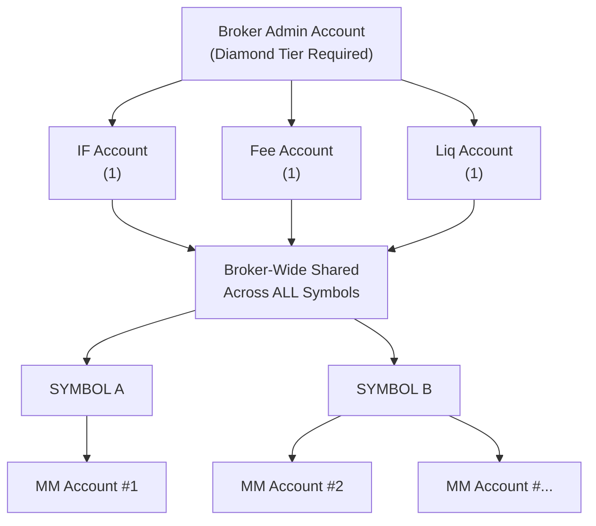
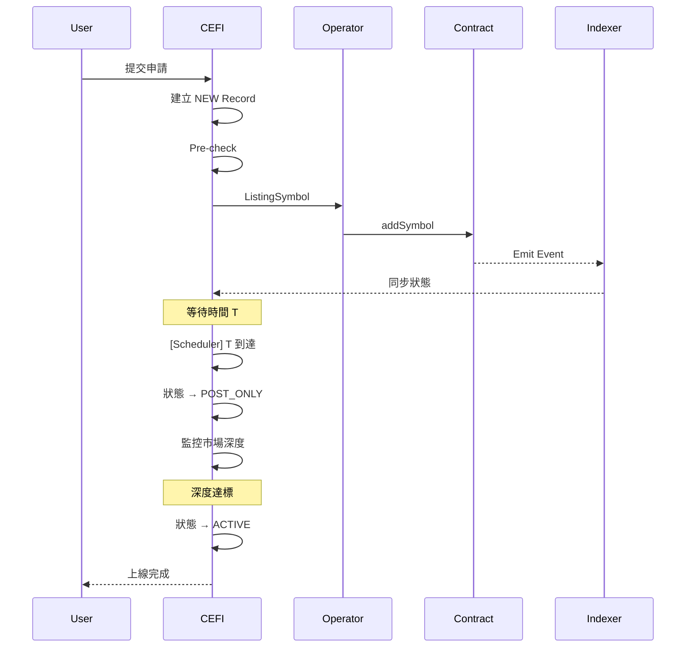

# 產品需求文件（PRD）— 無許可上架

## Reference

1. BRD: 
2. Figma: 
3. [Parameters Rules](./Orderly_Perps_Listing_Parameters_Rules.md)
4. [Frontend Requirements](./Permissionless_Listing_Frontend_Requirements.md)
5. [Slashing System](./Slashing_System.md)

---

# 1. 背景與問題

目前 Orderly Network 的 Symbol 上架流程依賴人工審核與特定的 MM 支持，這帶來了以下問題：
1. 上架效率低：人工流程導致上架速度慢，無法滿足市場快速變化的需求
2. 營運成本高：每上一個新 Symbol 都需要大量的人力投入進行審核與配置
3. 風險共擔問題：所有 Symbol 共用同一個保險基金 (Insurance Fund)，新幣種的高波動性可能威脅到平台的整體安全
4. 目前的無許可上架為市場趨勢，且過去的數據顯示快速上架可以帶來更多的交易量

因此，建立「無許可上架 (Permissionless Listing)」機制勢在必行。此機制將允許符合資格的 Broker（項目方）無許可完成上架，而平台則透過標準化的規則與自動化檢查來確保安全性與一致性。

---

# 2. 目標

## 2.1 產品目標
1. 無許可上幣：賦能符合資格 Broker 自行配置參數並上架 Symbol
2. 自動化風控：建立價格、流動性與保證金的自動化檢查機制，取代人工審核
3. 風險隔離：每個 Broker 僅有一個獨立 IF，覆蓋其所有 Symbols；該 Broker 的穿倉損失僅由其 IF 承擔，不影響平台與其他項目；ADL 僅針對特定 Symbol 執行（除平台主 IF 觸發外）
4. 維持標準：確保無許可上架 Symbol 仍具備完整的價格、保險、清算與流動性風控要素

## 2.2 業務目標
1. 生態擴展：大幅提升可交易 Symbol 的數量與上架速度，促進交易量增長
2. 責任轉移：
   - 項目方需自行擔任做市商 (MM) 並提供該 Symbol 的 IF(可以與其他同一項目方的Symbol共用)
   - 平台回歸技術提供者角色，專注於撮合與清算服務
3. 收益共享：提供 30%-50% 的交易手續費分潤作為激勵，吸引優質項目方參與

---

# 3. 限制與邊界

| # | 限制項目 | 說明 |
|---|----------|------|
| 1 | 資格限制 | 僅對滿足 Staking 要求的 Diamond Tier Broker 開放(交易達成的不行) |
| 2 | 帳號要求 | Broker 必須配置完整的帳號體系（IF、Fee、Liquidation、MM Account）才能進行上架 |
| 3 | 風控一致性 | 除上架流程外，交易層面的風控規則（如保證金計算、清算邏輯）與現有系統保持一致 |
| 4 | 一次性流程 | 本期僅支援「首次上架」，不支援無許可重新上架 (Re-listing)；若需重新上架需透過人工流程處理 |
| 5 | 參數變更 | 上架後僅允許項目方調整「手續費加成 (Fee Markup)」與「Max Notional」；其他參數需由 Orderly Admin 協助 |
| 6 | 資金隔離 | 項目方 IF 與平台主 IF 完全隔離，項目方 Symbol 的虧損責任僅限於其提供的 IF 餘額 |
| 7 | 唯一性 | 每個 Symbol 全平台唯一。當有人正在建立某 Symbol 的上架申請（NEW 階段）時，其他人無法針對該 Symbol 建立新的申請，直到原申請失效或完成。 |
| 8 | 黑名單 | 平台維護禁止上架的 Symbol 黑名單，項目方無法上架黑名單內的 Symbol |
| 9 | 保證金模式 | 這些Symbol僅支援 Isolated Margin (逐倉) |
| 10 | RWA 限制 | RWA 類資產暫不支援無許可上架 |

---

# 4. 無許可上架開發計畫

| 上架階段 | 優先級 | 開發範圍 |
|------|------|----------|
| 上架前 | 1 | 獨立帳號體系（IF、Fee、Liquidation、MM） |
| 上架前 | 1 | 資格驗證|
| 上架中 | 2 | 參數規則、風控檢查、自動上架流程 |
| 上架後 | 1 | 監控系統、警告機制 |
| 上架後 | 1 | 風控觸發後的限制交易狀態 |
| 下架 | 2 | 比照現在的下架流程，完成自動化 |
| 上架前/上架後 | 3 | 獨立手續費配置|

---

# 5. 上架前（Pre-listing）

## 5.1 帳號體系

項目方需建立以下子帳號以支援無許可上架。所有帳號由項目方自行管理與承擔風險。

### 帳號架構圖

### 帳號類型說明

| 帳號類型 | 數量 | Symbol 關係 | 交易限制 | 轉出限制 |
|----------|------|-------------|----------|----------|
| IF Account | 1 個 | 全部共用 | 僅 RO 單 | 餘額監控，轉出有限制 |
| Fee Account | 1 個 | 全部共用 | 禁止交易 | 無限制 |
| Liquidation Account | 1 個 | 全部共用 | 僅 RO 單 | 餘額監控，轉出有限制 |
| MM Account | N個 | N:1 | 限制交易綁定的 Symbol | 無限制 |

---

## 5.2 帳號管理

### IF / Fee / Liquidation Account

建立流程相同，但分開配置

| 步驟 | 操作 |
|------|------|
| 1 | 進入「帳號管理」頁面 |
| 2 | 點擊對應的 Account |
| 3 | 輸入子帳戶ID（須為 Admin Account 的子帳戶） |
| 4 | 系統確認並完成綁定 |
| 5 | 上線後仍可異動，只要新的account滿足資格要求|

異動流程（nice to have, later phase）

| 步驟 | 操作 |
|------|------|
| 1 | 進入「帳號管理」頁面 |
| 2 | 點擊對應的 Account |
| 3 | 輸入子帳戶ID（須為 Admin Account 的子帳戶） |
| 4 | 系統確認後並定期生效，等待時間不可再次變更（等待時間待確認） |

### MM Account

MM Account 需先建立，上架 Symbol 時再選擇綁定。

| 步驟 | 操作 | 驗證 |
|------|------|------|
| 1 | 進入「帳號管理」頁面 | - |
| 2 | 點擊「新增 MM Account」 | 檢查是否已達上限 |
| 3 | 輸入帳號名稱 | ≤ 50 字元 |
| 4 | 配置手續費 | 僅在Broker可配範圍內，不能小於base fee rate |
| 5 | 系統確認建立 | - |
| 6 | 上線後仍可異動，即時生效 |

> 建立後的 MM Account 可在上架 Symbol 時選擇綁定，一個 Symbol 可綁定多個 MM Account。

---

# 6. 申請上架（Listing）

## 6.1 上架流程

| 階段 | 觸發條件 | 執行者 | 動作 |
|------|---------|--------|------|
| 提交 | 用戶確認 | CEFI | 建立 NEW Record → Pre-check |
| 上傳 | Pre-check 通過 | Operator | 上傳 symbol, symbolHash, symbolContractID |
| 同步 | Contract Event | Indexer | 同步狀態至 CEFI |
| 等待 | - | CEFI | 等待時間 T 到達 |
| Post-only | 時間 T 到達 | CEFI | 開放 MM 掛單，監控深度 |
| Active | 深度達標 | CEFI | 開放所有用戶交易 |

**時間 T 規則：**
- T 必須 ≥ 當前時間 + 1 小時（以送出申請的系統時間為準）
- T 必須為整點時間（例：現在 14:35，最早可選 16:00）
- 不支援立即上架，時間不符合規則會拒絕

---

### 6.1.1 系統流程

### 6.1.2 狀態與權限

以下僅說明「誰有權限把狀態移到哪個狀態」，具體條件請參考 Listing Rules：
| 狀態 | 權限 | 說明 |
|------|------|------|
| NEW | Broker Admin | 提交申請 + Pre-check 通過 + 合約寫入成功 之後 |
| PENDING | SystemScheduler | 等待時間 T 到達之前 |
| POST_ONLY | System | 時間T到達之後 |
| ACTIVE | System  | 流動性達標之後 |
| REDUCE_ONLY | System | 觸發RO規則之後 |
| REDUCE_ONLY | Admin | 手動申請之後 |
| DELISTING | Broker Admin / System | - |
| DELISTED | System | 下架流程完成 |

> **Reduce-only 退出規則**：目前僅允許 Orderly Admin 手動解除，無自動退出機制。

## 6.2 自動化檢查

各項 Listing 參數與風控規則：
 **[Orderly Perps Listing Parameters Rules](./Orderly_Perps_Listing_Parameters_Rules.md)**  

---

# 7. 上架後（Post-listing）

詳細的監控項目、事件分級、清算與 ADL 流程，請參考：
 **[Orderly Perps Listing Parameters Rules - Post-listing Risk Control](./Orderly_Perps_Listing_Parameters_Rules.md#6-post-listing-risk-control-from-prd)**

# 8. 下架流程

## 8.1 項目方主動下架

| 步驟 | 操作 |
|------|------|
| 1 | 項目方提交下架申請，並選擇時間T |
| 2 | Symbol 立即進入 Reduce-only 狀態 |
| 3 | 到達時間T，進入Delisting狀態 |
| 4 | 下架完成，狀態改為 Delisted |

**時間 T 規則：**
- T 必須 ≥ 當前時間 + 1 小時（以送出申請的系統時間為準）
- T 必須為整點時間（例：現在 14:35，最早可選 16:00）

## 8.2 系統觸發下架

| 步驟 | 操作 |
|------|------|
| 1 | 觸發條件達成 |
| 2 | Symbol 立即進入 Reduce-only 狀態 |
| 3 | Reduce-only 後由系統進入 Delisting 狀態 |
| 4 | Symbol 完成下架，並且狀態改為 Delisted |
